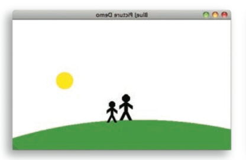

# COMP2001 F2022 Lab 1 Instructions

## Objectives

The problems are loosely based on the exercises presented in the course textbook. The credit problem (number 5) deals with two interacting classes and requires use of an if-statement. 

## Non-credit practice exercises

1.  Open the _figures_ project from Chapter 1 and save it as a _lab\_1\_picture_ project.
    *   Recreate the image below using the shapes from the _figures_ project.  
    *   While you are doing this, write down what you have to do to achieve this. Could it be done in different ways? Next record the state of your objects and create a new class MyPicture with a single method draw. Inside the draw method write the code to draw the image.
    *   Add a sunset to the Picture. That is, make the sun go down slowly. Remember: The circle has a method slowMoveVertical that you can use to do this.
    *   If you added your sunset to the end of the draw method (so that the sun goes down automatically when the picture is drawn), change this now. We now want the sunset in a separate method, so that we can call draw and see the picture with the sun up, and then call sunset (a separate method!) to make the sun go down.

2.  Close your previous project and create a new project _testing\_code\_pad_. Select _Show Code Pad_ from the _View_ menu. This should display a new pane next to the object bench in your main BlueJ window. This pane is the Code Pad. You can type Java code here. Consider the following expressions. Try to predict their results, and then type them in the Code Pad to check your answers.
    *   99 + 3
    *   "cat" + "fish"
    *   "cat" + 9
    *   9 + 3 + "cat"
    *   "cat" + 3 + 9
    *   "catfish".substring(3,4)
    *   "catfish".substring(3,8)
    *   ! (4 < 5)
    *   (2 > 2) || ((7 == 7) && (6 < 0))
    *   (8 > 8) || (4 == 4) && (3 < 0)

3.  Open the _lab-classes_ project from Chapter 1
    *   Create an object of class **Student**. You will notice that this time you are prompted not only for a name of the instance, but also for some other parameters. Fill them in before clicking OK.
    *   Create some additional **Student** objects. Call the **getName** method on each object. Explain what is happening.
    *   Create an object of class **LabClass**. As the signature indicates, you need to specify the maximum number of students in that class (an integer).
    *   Call the **numberOfStudents** method of that class. What does it do?
    *   Look at the signature of the **enrollStudent** method. You will notice that the type of the expected parameter is **Student**. Make sure you have two or three students and a **LabClass** object on the object bench, then call the **enrollStudent** method of the **LabClass** object. With the input cursor in the dialog entry field, click on one of the student objects; this enters the name of the student object into the parameter field of the **enrollStudent** method. Click OK and you have added the student to the **LabClass**. Add one or more other students as well.
    *   Call the **printList** method of the **LabClass** object. You will see a list of all the students in that class printed to the BlueJ terminal window.
    *   Use the inspector on a **LabClass** object to discover what fields it has.
    *   Set the instructor, room, and time for a lab, and print the list to the terminal window to check that these new details appear.

4.  Open the _mail_ project from chapter 3.
    *   Set up a scenario for investigation: Create a mail server, then create two mail clients for the users "**Sophie**" and “**Juan**” (you should name the instances **sophie** and **juan** as well so that you can better distinguish them on the object bench). Then use Sophie’s **sendMailItem** method to send a message to Juan. Do not read the message yet.
    *   Open the editor for the **MailClient** class and set a breakpoint at the first line of the **printNextMailItem** method.
    *   Run Juan's Client's **printNextMailItem** method
    *   Step one line forward in the execution of the recipient's **printNextMailItem** method by clicking the Step button.
    *   Predict which line will be marked as the next line to execute after the next step. Then execute another single step and check your prediction. Were you right or wrong? Explain what happened and why.
    *   Set up the same test situation as before. That is, send a message from **Sophie** to **Juan**. Then invoke the **printNextMailItem** message of Juan’s mail client again. Step forward as before. This time, when you reach the line **item.print();** use the Step Into command instead of the Step command. Make sure you can see the text terminal window as you step forward. What do you observe? Explain what you see.
    *   Set a breakpoint in the first line of the **sendMailItem** method in the **MailClient** class. Then invoke this method. Use the Step Into function to step into the constructor of the mail item. In the debugger display for the **MailItem** object, you can see the instance variables and local variables. Step further to see the instance variables get initialized.
    *   Use a combination of code reading, execution of methods, breakpoints, and single stepping to familiarize yourself with the **MailItem** and **MailClient** classes. Note that we have not yet discussed enough for you to understand the implementation of the **MailServer** class, so you can ignore this for now. Explain how the **MailClient** and **MailItem** classes interact. Draw object diagrams as part of your explanations.

## Credit problem

5. Checkout comp2001-lab1 repository from github classroom for the following credit work
    *  Confirm that the **mailtoo** package and the **grading** package are present in your submission project
    *  Open the **mailtoo** package and complete this lab credit work by modifying the **MailClient** class
    *  Modify the **MailClient** class to implement the methods as described in **MailClientInterface** so you can compile the java code in the package.  This will be compile errors until the method signatures required by the **MailClientInterface** are is satisfied by your code changes to **MailClient**. Note the declaration line of **MailClient** has been modified to indicate the implementation requirement to the compiler as follows.

           public class MailClient implements MailClientInterface

    * Modify the **MailClient** class to comply with the method signatures required by the  **MailClientInterface**. This should allow the **MailClient** class to compile without compile errors.
    * Open the **grading** package. You should now be able to compile and the JUNIT tests included in **MailTest** class of the **grading** package to check your lab score based on the run time behaviour of your **MailClient** code. Test scores should appear in the terminal window when you run the JUNIT tests. Results of the tests and the The JavaDoc in the **MailClientInterface** will help you figure out how to correctly implement the interface in order to pass the tests.
    * Work on modifying the **MailClient** class to pass the included tests up to the end of the lab period. Don't forget the debugging tools practiced in exercise 4 are available to help you.
    * Commit and push your project that includes your modification to the **mailtoo** package _before the end of the lab session_.  Only the most recent push to the remote git repository at github classroom prior to the end of the lab session will count toward the lab grade. Since you can commit and push as many times as you want, you should consider pushing your changes wherever your score improves.

